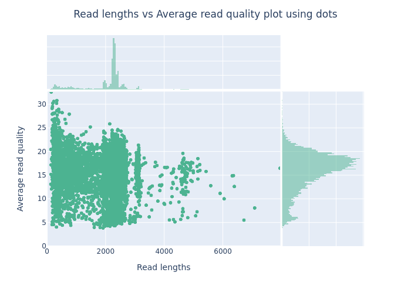
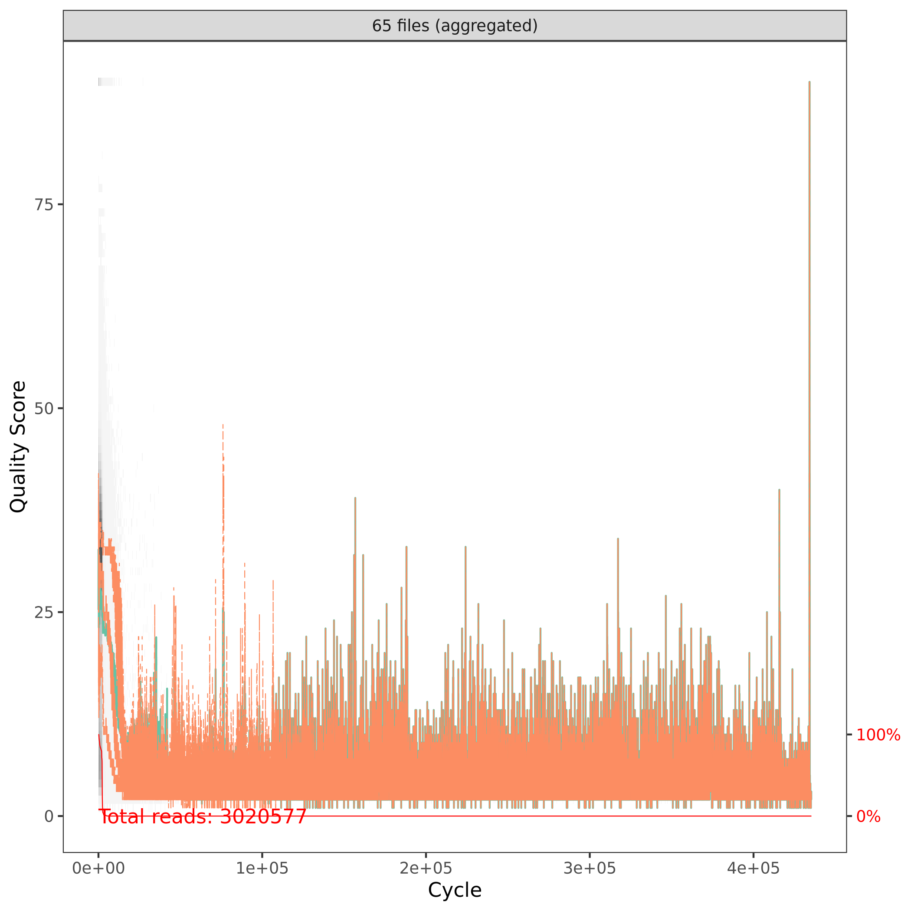
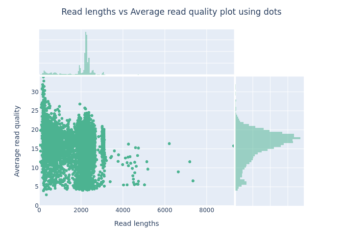
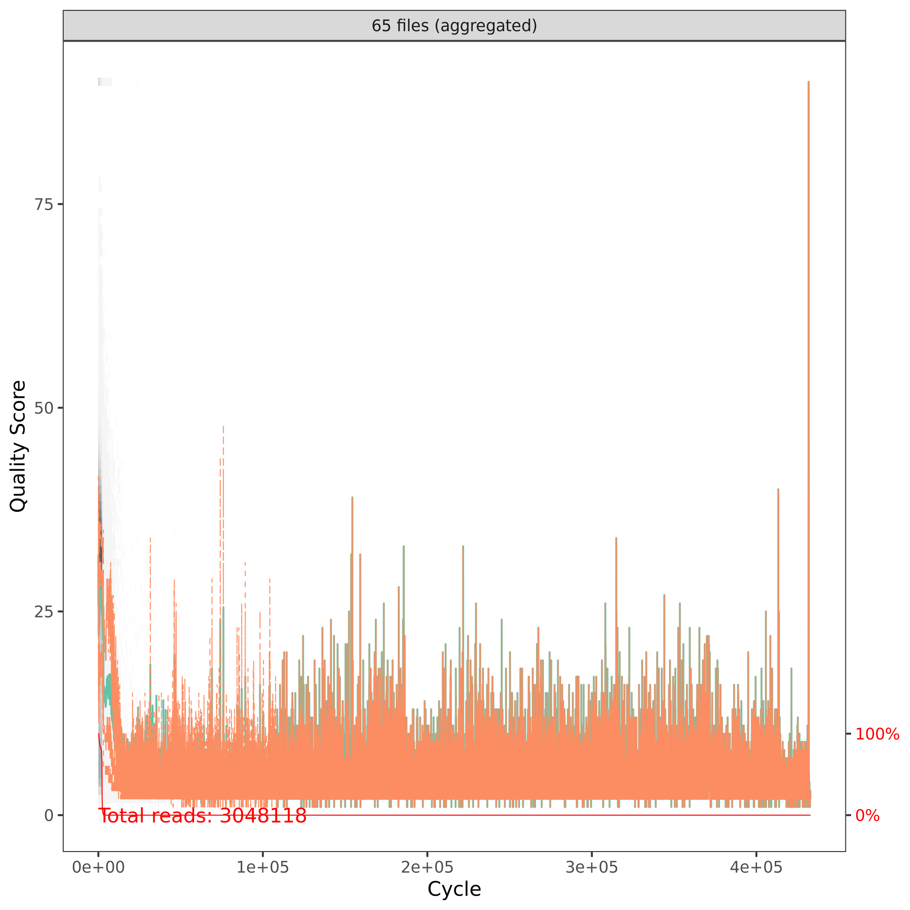
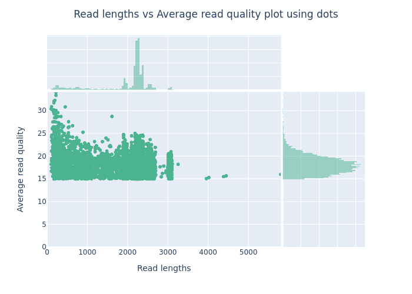
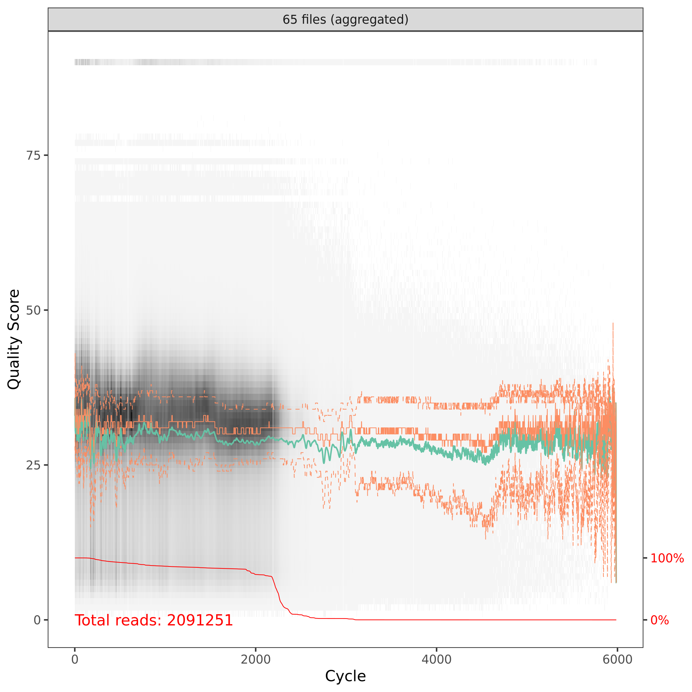
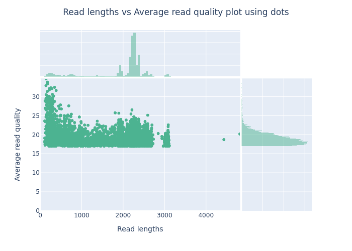
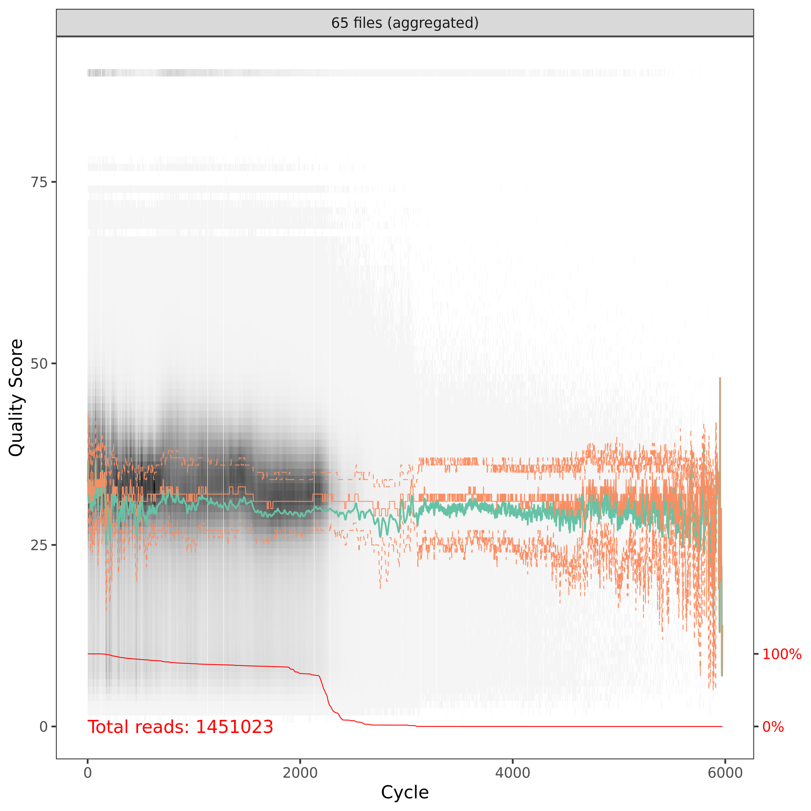
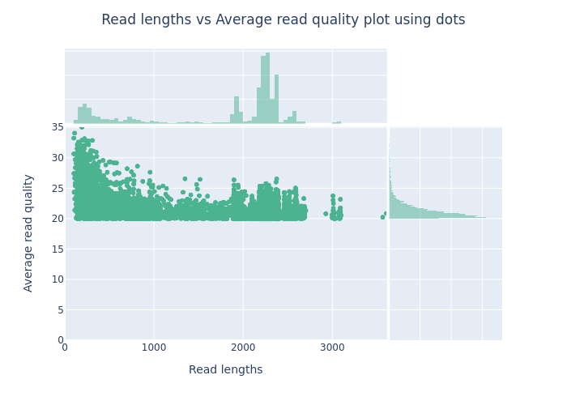
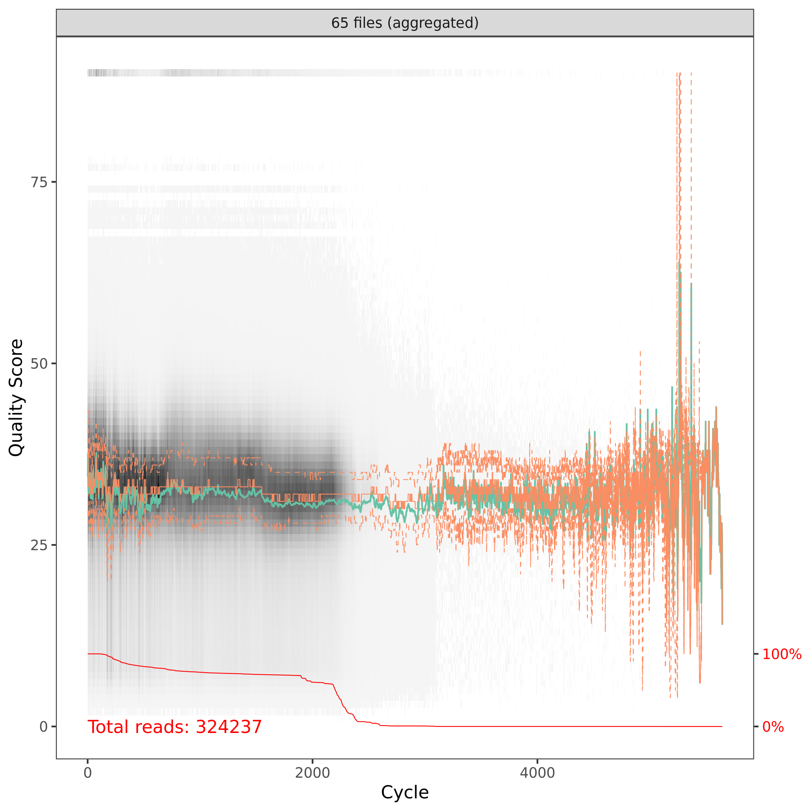

# Raw reads
| Avg. Read Quality vs Length | Base Quality by Position |
| -- | -- |
|  |  |

| NanoStats | |
| -- | -- |
| number_of_reads | 3020577 |
| number_of_bases | 6149026204.0 |
| median_read_length | 2267.0 |
| mean_read_length | 2035.7 |
| read_length_stdev | 797.9 |
| mean_qual | 13.2 |
| median_qual | 16.8 |
| Reads >Q5: | 3000402 (99.3%) 6111.0Mb |
| Reads >Q7: | 2878392 (95.3%) 5859.2Mb |
| Reads >Q10: | 2734147 (90.5%) 5570.2Mb |
| Reads >Q12: | 2547433 (84.3%) 5200.4Mb |
| Reads >Q15: | 2062786 (68.3%) 4238.9Mb |

# Porechop (adapters, barcodes and primers)
| Avg. Read Quality vs Length | Base Quality by Position |
| -- | -- |
|  |  |

| NanoStats | |
| -- | -- |
| number_of_reads | 3048118 |
| number_of_bases | 6003282121.0 |
| median_read_length | 2221.0 |
| mean_read_length | 1969.5 |
| read_length_stdev | 739.2 |
| mean_qual | 13.2 |
| median_qual | 16.8 |
| Reads >Q5: | 3027369 (99.3%) 5964.6Mb |
| Reads >Q7: | 2905271 (95.3%) 5718.5Mb |
| Reads >Q10: | 2760428 (90.6%) 5438.8Mb |
| Reads >Q12: | 2575165 (84.5%) 5086.3Mb |
| Reads >Q15: | 2091803 (68.6%) 4165.6Mb |

# Filtering min Q15
| Avg. Read Quality vs Length | Base Quality by Position |
| -- | -- |
|  |  |

| NanoStats | |
| -- | -- |
| number_of_reads | 2091251 |
| number_of_bases | 4164636649.0 |
| median_read_length | 2227.0 |
| mean_read_length | 1991.5 |
| read_length_stdev | 653.2 |
| mean_qual | 17.3 |
| median_qual | 18.0 |
| Reads >Q5: | 2091251 (100.0%) 4164.6Mb |
| Reads >Q7: | 2091251 (100.0%) 4164.6Mb |
| Reads >Q10: | 2091251 (100.0%) 4164.6Mb |
| Reads >Q12: | 2091251 (100.0%) 4164.6Mb |
| Reads >Q15: | 2091251 (100.0%) 4164.6Mb |

# Filtering min Q17
| Avg. Read Quality vs Length | Base Quality by Position |
| -- | -- |
|  |  |

| NanoStats | |
| -- | -- |
| number_of_reads | 1451023 |
| number_of_bases | 2880709635.0 |
| median_read_length | 2227.0 |
| mean_read_length | 1985.3 |
| read_length_stdev | 657.8 |
| mean_qual | 18.3 |
| median_qual | 18.7 |
| Reads >Q5: | 1451023 (100.0%) 2880.7Mb |
| Reads >Q7: | 1451023 (100.0%) 2880.7Mb |
| Reads >Q10: | 1451023 (100.0%) 2880.7Mb |
| Reads >Q12: | 1451023 (100.0%) 2880.7Mb |
| Reads >Q15: | 1451023 (100.0%) 2880.7Mb |

# Filtering min Q20
| Avg. Read Quality vs Length | Base Quality by Position |
| -- | -- |
|  |  |

| NanoStats | |
| -- | -- |
| number_of_reads | 324237 |
| number_of_bases | 566984975.0 |
| median_read_length | 2202.0 |
| mean_read_length | 1748.7 |
| read_length_stdev | 822.6 |
| mean_qual | 20.8 |
| median_qual | 20.9 |
| Reads >Q5: | 324237 (100.0%) 567.0Mb |
| Reads >Q7: | 324237 (100.0%) 567.0Mb |
| Reads >Q10: | 324237 (100.0%) 567.0Mb |
| Reads >Q12: | 324237 (100.0%) 567.0Mb |
| Reads >Q15: | 324237 (100.0%) 567.0Mb |

